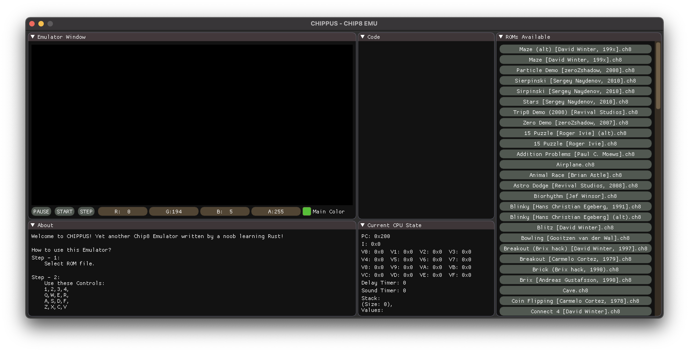
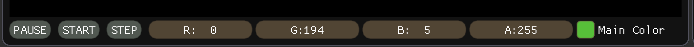

[![MIT License][license-shield]][license-url]

<!-- PROJECT LOGO -->
<br />
<p align="center">
  <a href="https://github.com/github_username/repo_name">
    
  </a>

  <h3 align="center">CHIPPUS - A Chip8 Emulator (WIP)</h3>

  <p align="center">
  A Chip8 Emulator written in Rust
  </p>
</p>


<!-- TABLE OF CONTENTS -->
<details open="open">
  <summary><h2 style="display: inline-block">Table of Contents</h2></summary>
  <ol>
    <li>
      <a href="#about-the-project">About The Project</a>
      <ul>
        <li><a href="#built-with">Built With</a></li>
      </ul>
    </li>
    <li>
      <a href="#getting-started">Getting Started</a>
      <ul>
        <li><a href="#prerequisites">Prerequisites</a></li>
        <li><a href="#installation">Installation</a></li>
      </ul>
    </li>
    <li><a href="#usage">Usage</a></li>
    <ul>
        <li><a href="#how-to-run">How to Run</a></li>
        <li><a href="#example-images">Example Images</a></li>
      </ul>
    <li><a href="#license">License</a></li>
  </ol>
</details>


<!-- ABOUT THE PROJECT -->
## About The Project

This is an "emulator" for <a href="https://en.wikipedia.org/wiki/CHIP-8"><i>Chip8</i></a> which is an old interpreted language. I did this is as learning project,
to familiarize myself with Rust and have fun along with it. As such it may not be the best implementation as I mainly focused on understanding the syntax and workings of Rust. 
The emulator has a UI, and multiple roms are provided (more can be added, check Usage).


### Built With

* [Rust](https://www.rust-lang.org)
* [Imgui-rs](https://github.com/imgui-rs/imgui-rs)
* [Imgui-Wgpu](https://github.com/Yatekii/imgui-wgpu-rs) - Since I needed Nearest Filtering Mode for Textures, and right now since there is no method in the Imgui-wgpu-rs to pass that from outside, I copied the entire lib.rs code and added it into my own project and modified where needed.
* [ROMs](https://github.com/dmatlack/chip8/tree/master/roms)

## Demo
* Example of Execution
  

<!-- GETTING STARTED -->
## Getting Started

To get a local copy up and running follow these simple steps.

### Prerequisites

* [Rust](https://www.rust-lang.org/tools/install)
* [git](https://git-scm.com)

### Installation

1. Clone the repo
   ```sh
   git clone https://github.com/saeenyoda/Chippus
   ```

## Usage

### How to Run
1. Open up command line or terminal and navigate to the cloned repo's directory
   ```sh
   cd "PATH-TO-DIRECTORY"
   ```
2. Run with
   ```sh
   cargo run
   ```

* This will download all dependencies and show the following screen:


* Now Select one of the ROMs from the list on the right, and it will run.
    
   ***NOTE:***  
   &nbsp;&nbsp;&nbsp;&nbsp;&nbsp;&nbsp;`You can add more ROMs (compatible with original CHIP-8, not modified ones) and to do so, just put the .ch8 file in the roms folder, and run the program.`
    

* You can also pause, start and step through the execution with the buttons in the emulator screen. You can also change color of output with the color picker
  in the emulator screen. (Image below).
  
  

<!-- LICENSE -->
## License

Distributed under the MIT License. See `LICENSE` for more information.


<!-- MARKDOWN LINKS & IMAGES -->
<!-- https://www.markdownguide.org/basic-syntax/#reference-style-links -->
[license-shield]: https://img.shields.io/github/license/saeenyoda/Inverted_Indexing?label=license&style=for-the-badge
[license-url]: https://github.com/saeenyoda/Inverted_Indexing/blob/master/LICENSE
